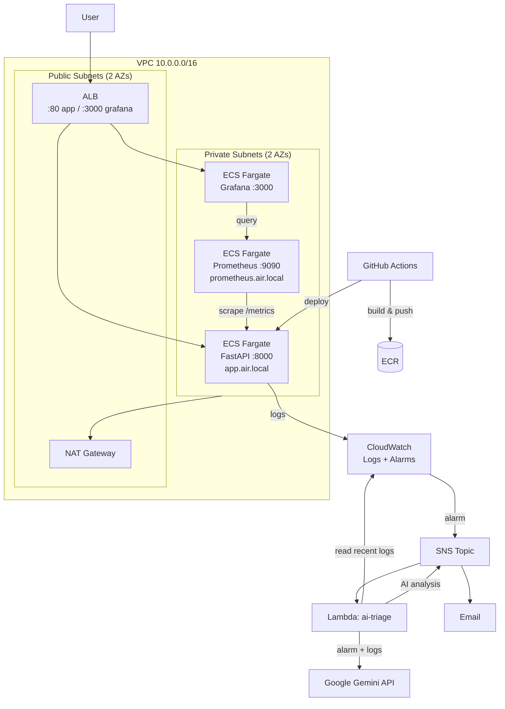
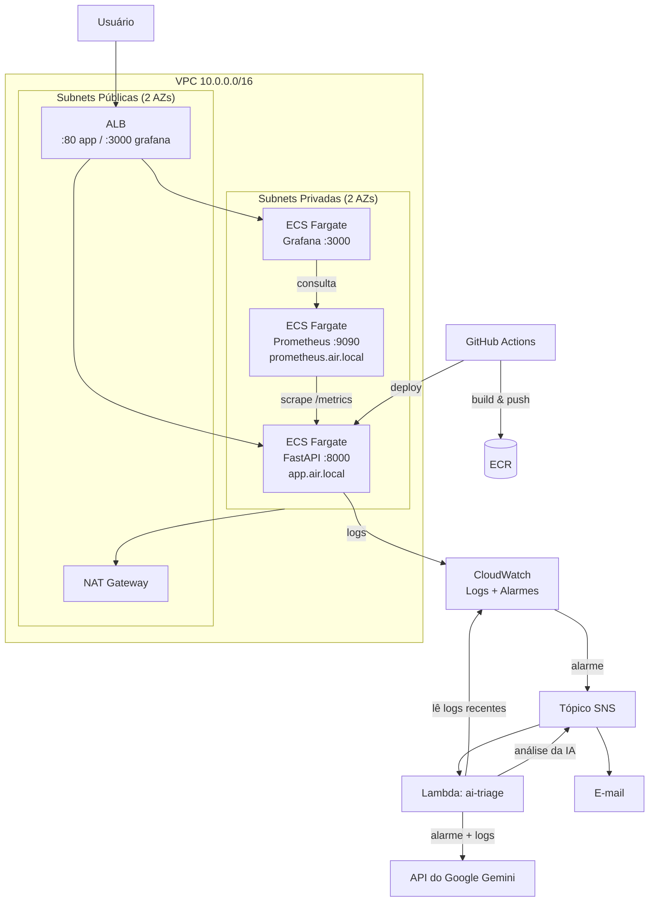

# AI-Powered Incident Response Platform

> A platform that provisions AWS infrastructure via IaC, exposes an API, ships full observability, and uses AI to analyze alerts/logs and suggest a root cause.

**[English](#english) · [Português](#português)**

---

## English

### Overview

`air` (AI Incident Response) is an end-to-end SRE lab project. It provisions a complete AWS environment with Terraform, runs a FastAPI service on ECS Fargate behind an ALB, collects metrics with Prometheus/Grafana and logs with CloudWatch, and closes the loop with an **AI triage Lambda**: when a CloudWatch alarm fires, the Lambda pulls the application's recent logs, sends them to Google Gemini along with the alarm context, and publishes a root-cause analysis back to the alert channel.

### Architecture



### Tech stack

| Layer | Technology |
|---|---|
| IaC | Terraform (S3 remote state + DynamoDB lock) |
| Compute | AWS ECS Fargate |
| Networking | VPC, 2 public + 2 private subnets, IGW, NAT Gateway, ALB, Cloud Map service discovery |
| API | Python 3.12, FastAPI, Pydantic |
| Metrics | Prometheus + Grafana (both containerized on ECS) |
| Logs & Alerts | CloudWatch Logs, CloudWatch Alarms, SNS |
| AI | AWS Lambda (Python 3.12) + Google Gemini |
| CI/CD | GitHub Actions → ECR → ECS |
| Registry | ECR (immutable tags, scan-on-push, keep last 10 images) |

### Repository structure

```
.
├── .github/workflows/pipeline.yaml   # CI/CD: build → ECR → deploy to ECS
├── app/                              # FastAPI application
│   ├── api/routes/                   # health + incidents endpoints
│   ├── core/config.py                # Pydantic settings
│   ├── models/incidents.py           # Incident model + Severity enum
│   └── Dockerfile                    # multi-stage, non-root user
├── lambda/ai-triage/handler.py       # AI triage function
├── prometheus/                       # Dockerfile + scrape config
├── grafana/                          # Dockerfile + provisioned datasource
└── Terraform/
    ├── bootstrap/                    # state bucket, lock table, CI IAM user
    ├── Network/                      # VPC, subnets, IGW, NAT, routes
    ├── ecr/                          # 3 repositories + lifecycle policies
    ├── compute/                      # ECS cluster, ALB, services, SGs, IAM
    ├── observability/                # SNS topic + CloudWatch alarms
    └── ai-triage/                    # Lambda, IAM, SNS subscription
```

### Terraform modules

Each module keeps its own state in S3 and reads upstream values through `terraform_remote_state`. **Apply them in this order** — later modules depend on earlier outputs.

| # | Module | Creates | Depends on |
|---|---|---|---|
| 1 | `bootstrap` | State bucket (versioned + encrypted), DynamoDB lock table, `air-github-actions` IAM user | — (local state) |
| 2 | `Network` | VPC `10.0.0.0/16`, 2 public + 2 private subnets, IGW, NAT GW, route tables | bootstrap |
| 3 | `ecr` | `air-app`, `air-prometheus`, `air-grafana` repositories | bootstrap |
| 4 | `compute` | ECS cluster (Container Insights on), ALB + listeners, 3 Fargate services, security groups, `air.local` service discovery, log groups, execution role | Network, ecr |
| 5 | `observability` | SNS topic + email subscription, 3 CloudWatch alarms | compute |
| 6 | `ai-triage` | Lambda, IAM role/policies, SNS subscription + invoke permission | observability |

### Monitoring & alerting

**CloudWatch alarms** (all publish to the same SNS topic):

| Alarm | Condition |
|---|---|
| `air-high-cpu` | ECS service CPU > 80% for 2 consecutive minutes |
| `air-unhealthy-targets` | At least 1 unhealthy target in the ALB target group |
| `air-high-5xx` | More than 5 HTTP 5xx responses in 1 minute |

**Metrics flow:** FastAPI exposes `/metrics` via `prometheus-fastapi-instrumentator` → Prometheus scrapes `app.air.local:8000` every 15s → Grafana queries `prometheus.air.local:9090` through a pre-provisioned datasource.

### AI triage flow

1. A CloudWatch alarm transitions to `ALARM` and publishes to the SNS topic.
2. SNS invokes the `air-ai-triage` Lambda.
3. The Lambda reads the last 10 minutes of logs (up to 30 events) from the `/ecs/air-app` log group.
4. It fetches the Gemini API key from SSM Parameter Store (`/air/gemini/api-key`, encrypted) and prompts the model as an experienced SRE.
5. The model returns **probable root cause**, **recommended immediate action**, and **urgency level**.
6. The Lambda publishes the analysis back to SNS, so it reaches the subscribed email.

### Prerequisites

- Terraform >= 1.5
- AWS CLI configured with credentials
- Docker
- Python 3.12
- A Google Gemini API key

Two SSM parameters must exist **before** the corresponding `apply` — Terraform does not create them:

```bash
aws ssm put-parameter --name "/air/grafana/admin-password" --value "<your-password>" --type SecureString
aws ssm put-parameter --name "/air/gemini/api-key"        --value "<your-api-key>"  --type SecureString
```

### Deployment

```bash
# 1. Bootstrap — creates the state backend (uses local state)
cd Terraform/bootstrap && terraform init && terraform apply

# 2. Network
cd ../Network && terraform init && terraform apply

# 3. ECR
cd ../ecr && terraform init && terraform apply

# 4. Build and push the images (repeat for prometheus/ and grafana/)
aws ecr get-login-password --region us-east-1 \
  | docker login --username AWS --password-stdin <account-id>.dkr.ecr.us-east-1.amazonaws.com
cd ../../app
docker build -t <account-id>.dkr.ecr.us-east-1.amazonaws.com/air-app:v2 .
docker push <account-id>.dkr.ecr.us-east-1.amazonaws.com/air-app:v2

# 5. Compute
cd ../Terraform/compute && terraform init && terraform apply

# 6. Observability — pass your alert email
cd ../observability && terraform init && terraform apply -var="alert_email=you@example.com"

# 7. AI triage — zip the handler first
cd ../../lambda/ai-triage && zip function.zip handler.py
cd ../../Terraform/ai-triage && terraform init && terraform apply
```

> Confirm the SNS subscription in your inbox — AWS will not deliver alerts until you click the confirmation link.

### Running locally

```bash
cd app
pip install -r requirements.txt
uvicorn main:app --reload
```

The API is then available at `http://127.0.0.1:8000`, with interactive docs at `/docs`.

### API endpoints

| Method | Path | Description |
|---|---|---|
| `GET` | `/` | Service name and environment |
| `GET` | `/health` | Health check (used by the ALB target group) |
| `GET` | `/metrics` | Prometheus metrics |
| `GET` | `/incidents` | List all incidents |
| `POST` | `/incidents` | Create an incident (query params: `title`, `description`, `severity`) |
| `GET` | `/incidents/{id}` | Fetch one incident (404 if not found) |

```bash
curl -X POST "http://localhost:8000/incidents?title=API%20down&description=502%20from%20ALB&severity=high"
```

`severity` accepts `low`, `medium`, `high`, or `critical`.

### CI/CD

`.github/workflows/pipeline.yaml` triggers on pushes to `main` that touch `app/**`. It builds the image tagged with the commit SHA, pushes it to ECR, renders a new task definition with that image, and deploys to the `air-service` ECS service, waiting for stability.

Required repository secrets: `AWS_ACCESS_KEY_ID` and `AWS_SECRET_ACCESS_KEY` (from the `air-github-actions` IAM user created by `bootstrap`).

### Known limitations

- **Incidents are stored in memory** (`incidents_db` dict) — data is lost on every restart and is not shared between tasks if `desired_count > 1`. A real database is the natural next step.
- **The AI triage Lambda publishes to the same SNS topic that triggers it.** Its own message is not valid alarm JSON, so the re-invocation fails and is discarded rather than looping forever — but it does produce spurious Lambda errors. A separate "notifications" topic would be cleaner.
- **Grafana is exposed on port 3000 to `0.0.0.0/0`** over plain HTTP. Fine for a lab, not for production — restrict the CIDR and put TLS in front of it.
- Container image tags are pinned per module (`v1`/`v2`) for Prometheus and Grafana; only the app image is updated automatically by CI.

---

## Português

### Visão geral

`air` (AI Incident Response) é um projeto-laboratório de SRE de ponta a ponta. Ele provisiona um ambiente AWS completo com Terraform, roda uma API FastAPI em ECS Fargate atrás de um ALB, coleta métricas com Prometheus/Grafana e logs no CloudWatch, e fecha o ciclo com uma **Lambda de triagem por IA**: quando um alarme do CloudWatch dispara, a Lambda busca os logs recentes da aplicação, envia para o Google Gemini junto com o contexto do alarme, e publica uma análise de causa raiz de volta no canal de alertas.

### Arquitetura



### Stack

| Camada | Tecnologia |
|---|---|
| IaC | Terraform (state remoto no S3 + lock no DynamoDB) |
| Computação | AWS ECS Fargate |
| Rede | VPC, 2 subnets públicas + 2 privadas, IGW, NAT Gateway, ALB, service discovery via Cloud Map |
| API | Python 3.12, FastAPI, Pydantic |
| Métricas | Prometheus + Grafana (ambos containerizados no ECS) |
| Logs e alertas | CloudWatch Logs, CloudWatch Alarms, SNS |
| IA | AWS Lambda (Python 3.12) + Google Gemini |
| CI/CD | GitHub Actions → ECR → ECS |
| Registry | ECR (tags imutáveis, scan on push, mantém as últimas 10 imagens) |

### Estrutura do repositório

```
.
├── .github/workflows/pipeline.yaml   # CI/CD: build → ECR → deploy no ECS
├── app/                              # aplicação FastAPI
│   ├── api/routes/                   # endpoints de health e incidents
│   ├── core/config.py                # settings via Pydantic
│   ├── models/incidents.py           # modelo Incident + enum Severity
│   └── Dockerfile                    # multi-stage, usuário não-root
├── lambda/ai-triage/handler.py       # função de triagem por IA
├── prometheus/                       # Dockerfile + config de scrape
├── grafana/                          # Dockerfile + datasource provisionado
└── Terraform/
    ├── bootstrap/                    # bucket de state, tabela de lock, usuário IAM do CI
    ├── Network/                      # VPC, subnets, IGW, NAT, rotas
    ├── ecr/                          # 3 repositórios + lifecycle policies
    ├── compute/                      # cluster ECS, ALB, services, SGs, IAM
    ├── observability/                # tópico SNS + alarmes do CloudWatch
    └── ai-triage/                    # Lambda, IAM, subscription no SNS
```

### Módulos Terraform

Cada módulo mantém seu próprio state no S3 e lê os valores dos anteriores via `terraform_remote_state`. **Aplique nesta ordem** — os módulos posteriores dependem dos outputs dos anteriores.

| # | Módulo | Cria | Depende de |
|---|---|---|---|
| 1 | `bootstrap` | Bucket de state (versionado + criptografado), tabela de lock no DynamoDB, usuário IAM `air-github-actions` | — (state local) |
| 2 | `Network` | VPC `10.0.0.0/16`, 2 subnets públicas + 2 privadas, IGW, NAT GW, route tables | bootstrap |
| 3 | `ecr` | Repositórios `air-app`, `air-prometheus`, `air-grafana` | bootstrap |
| 4 | `compute` | Cluster ECS (com Container Insights), ALB + listeners, 3 services Fargate, security groups, service discovery `air.local`, log groups, execution role | Network, ecr |
| 5 | `observability` | Tópico SNS + subscription por e-mail, 3 alarmes do CloudWatch | compute |
| 6 | `ai-triage` | Lambda, role/policies IAM, subscription no SNS + permissão de invoke | observability |

### Monitoramento e alertas

**Alarmes do CloudWatch** (todos publicam no mesmo tópico SNS):

| Alarme | Condição |
|---|---|
| `air-high-cpu` | CPU do service ECS acima de 80% por 2 minutos seguidos |
| `air-unhealthy-targets` | Pelo menos 1 target unhealthy no target group do ALB |
| `air-high-5xx` | Mais de 5 respostas HTTP 5xx em 1 minuto |

**Fluxo das métricas:** o FastAPI expõe `/metrics` via `prometheus-fastapi-instrumentator` → o Prometheus faz scrape de `app.air.local:8000` a cada 15s → o Grafana consulta `prometheus.air.local:9090` por um datasource já provisionado.

### Fluxo da triagem por IA

1. Um alarme do CloudWatch entra em estado `ALARM` e publica no tópico SNS.
2. O SNS invoca a Lambda `air-ai-triage`.
3. A Lambda lê os últimos 10 minutos de logs (até 30 eventos) do log group `/ecs/air-app`.
4. Busca a API key do Gemini no SSM Parameter Store (`/air/gemini/api-key`, criptografada) e monta um prompt pedindo uma análise no papel de um SRE experiente.
5. O modelo devolve **possível causa raiz**, **ação recomendada imediata** e **nível de urgência**.
6. A Lambda publica a análise de volta no SNS, que entrega no e-mail inscrito.

### Pré-requisitos

- Terraform >= 1.5
- AWS CLI configurado com credenciais
- Docker
- Python 3.12
- Uma API key do Google Gemini

Dois parâmetros no SSM precisam existir **antes** do `apply` correspondente — o Terraform não os cria:

```bash
aws ssm put-parameter --name "/air/grafana/admin-password" --value "<sua-senha>"   --type SecureString
aws ssm put-parameter --name "/air/gemini/api-key"        --value "<sua-api-key>" --type SecureString
```

### Deploy

```bash
# 1. Bootstrap — cria o backend de state (usa state local)
cd Terraform/bootstrap && terraform init && terraform apply

# 2. Network
cd ../Network && terraform init && terraform apply

# 3. ECR
cd ../ecr && terraform init && terraform apply

# 4. Build e push das imagens (repita para prometheus/ e grafana/)
aws ecr get-login-password --region us-east-1 \
  | docker login --username AWS --password-stdin <account-id>.dkr.ecr.us-east-1.amazonaws.com
cd ../../app
docker build -t <account-id>.dkr.ecr.us-east-1.amazonaws.com/air-app:v2 .
docker push <account-id>.dkr.ecr.us-east-1.amazonaws.com/air-app:v2

# 5. Compute
cd ../Terraform/compute && terraform init && terraform apply

# 6. Observability — informe seu e-mail de alerta
cd ../observability && terraform init && terraform apply -var="alert_email=voce@exemplo.com"

# 7. AI triage — gere o zip do handler primeiro
cd ../../lambda/ai-triage && zip function.zip handler.py
cd ../../Terraform/ai-triage && terraform init && terraform apply
```

> Confirme a subscription do SNS na sua caixa de entrada — a AWS não entrega alertas enquanto você não clicar no link de confirmação.

### Rodando localmente

```bash
cd app
pip install -r requirements.txt
uvicorn main:app --reload
```

A API fica disponível em `http://127.0.0.1:8000`, com a documentação interativa em `/docs`.

### Endpoints da API

| Método | Rota | Descrição |
|---|---|---|
| `GET` | `/` | Nome do serviço e ambiente |
| `GET` | `/health` | Health check (usado pelo target group do ALB) |
| `GET` | `/metrics` | Métricas do Prometheus |
| `GET` | `/incidents` | Lista todos os incidentes |
| `POST` | `/incidents` | Cria um incidente (query params: `title`, `description`, `severity`) |
| `GET` | `/incidents/{id}` | Busca um incidente (404 se não existir) |

```bash
curl -X POST "http://localhost:8000/incidents?title=API%20fora&description=502%20no%20ALB&severity=high"
```

`severity` aceita `low`, `medium`, `high` ou `critical`.

### CI/CD

O `.github/workflows/pipeline.yaml` roda em pushes na `main` que alteram `app/**`. Ele builda a imagem com a tag do SHA do commit, envia para o ECR, gera uma nova task definition com essa imagem e faz o deploy no service `air-service`, aguardando a estabilização.

Secrets necessários no repositório: `AWS_ACCESS_KEY_ID` e `AWS_SECRET_ACCESS_KEY` (do usuário IAM `air-github-actions` criado pelo `bootstrap`).

### Limitações conhecidas

- **Os incidentes ficam em memória** (dict `incidents_db`) — os dados se perdem a cada restart e não são compartilhados entre tasks se `desired_count > 1`. Um banco de dados real é o próximo passo natural.
- **A Lambda de triagem publica no mesmo tópico SNS que a dispara.** A mensagem que ela mesma gera não é um JSON de alarme válido, então a reinvocação falha e é descartada em vez de entrar em loop infinito — mas gera erros espúrios na Lambda. Um tópico separado de "notificações" seria mais limpo.
- **O Grafana está exposto na porta 3000 para `0.0.0.0/0`** em HTTP puro. Aceitável em laboratório, não em produção — restrinja o CIDR e coloque TLS na frente.
- As tags das imagens de Prometheus e Grafana estão fixas (`v1`/`v2`) nos módulos; apenas a imagem da aplicação é atualizada automaticamente pelo CI.
